# SQL Injection Attack Simulation — Detection Analysis

## Objective
Simulate a real SQL injection attack against a genuinely vulnerable login endpoint (raw string-concatenated SQL query, real SQLite backend — not fabricated log data), analyze the resulting activity in Splunk, and build a working detection rule, alert, and dashboard a SOC analyst would use to catch it.

## Environment
- SIEM: Splunk Enterprise (local lab)
- Target: Flask + SQLite login endpoint (`vulnerable_sqli_target.py`) — real unsafe query: `SELECT * FROM users WHERE username='{user}' AND password='{pw}'`
- Attacker: Python script (`sqli_attacker.py`) — 10 real SQLi payloads sent via `requests`
- Log Source: `sqli_logs.log`
- Sourcetype: `sqli_detection_analysis`
- Index: `main`

## Queries Used

**Raw event inspection — confirm log fields:**
```spl
source="sqli_logs.log" host="KALI" sourcetype="sqli_detection_analysis"
| head 10
```
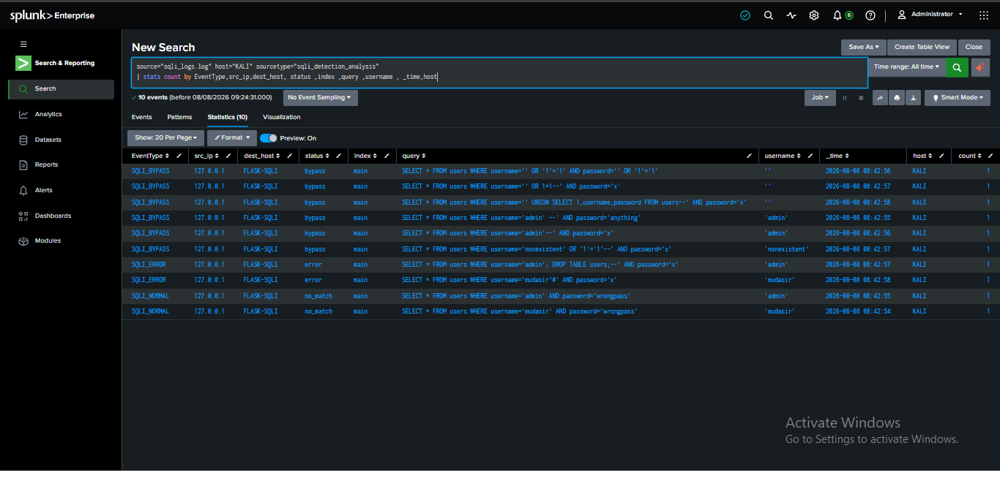

**Stats grouped by type, source, host, status, index, query, username, time, host:**
```spl
source="sqli_logs.log" host="KALI" sourcetype="sqli_detection_analysis"
| stats count by EventType,src_ip,dest_host, status ,index ,query ,username , _time,host
```
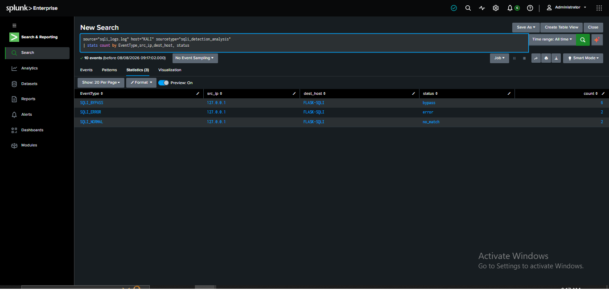

**Stats grouped by type, source, host, status, index, query, username, time:**
```spl
source="sqli_logs.log" host="KALI" sourcetype="sqli_detection_analysis"
| stats count by EventType,src_ip,dest_host, status ,index ,query ,username , _time
```
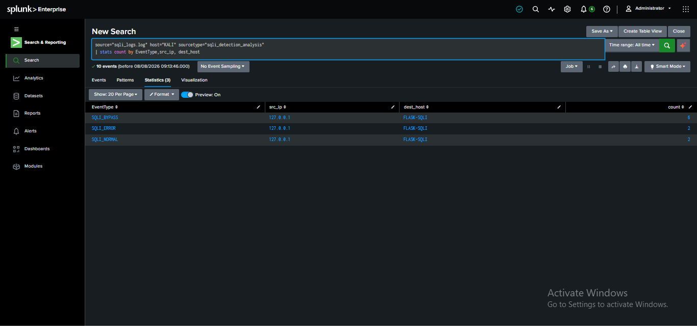

**Stats grouped by type, source, host, status, index, query, username:**
```spl
source="sqli_logs.log" host="KALI" sourcetype="sqli_detection_analysis"
| stats count by EventType,src_ip,dest_host, status ,index ,query ,username
```
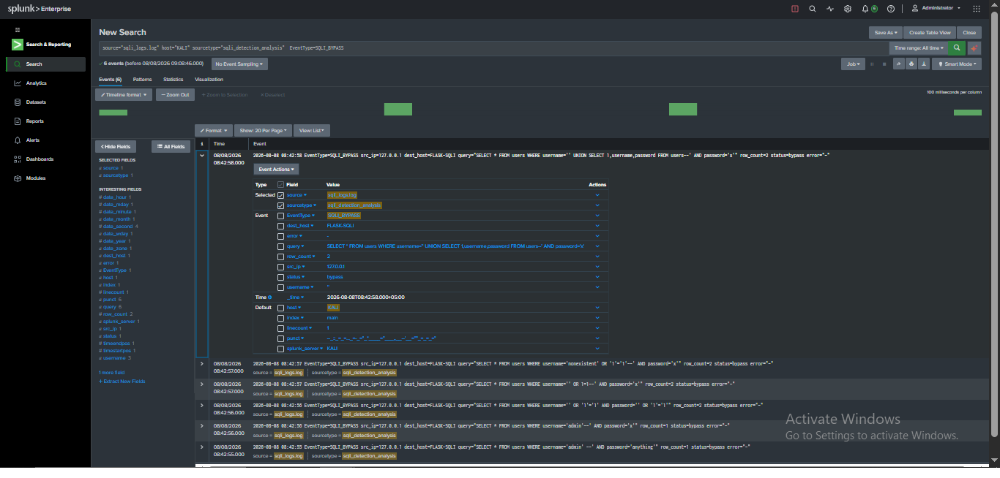

**Stats grouped by type, source, host, status, index, query:**
```spl
source="sqli_logs.log" host="KALI" sourcetype="sqli_detection_analysis"
| stats count by EventType,src_ip,dest_host, status ,index ,query
```
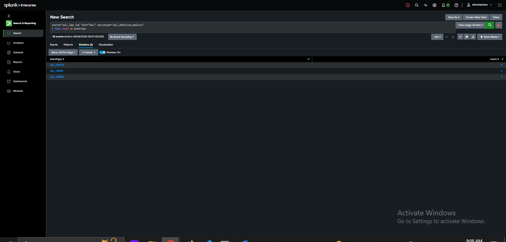

**Stats grouped by type, source, host, status:**
```spl
source="sqli_logs.log" host="KALI" sourcetype="sqli_detection_analysis"
| stats count by EventType,src_ip,dest_host, status
```


**Stats grouped by type, source, host only:**
```spl
source="sqli_logs.log" host="KALI" sourcetype="sqli_detection_analysis"
| stats count by EventType,src_ip, dest_host
```
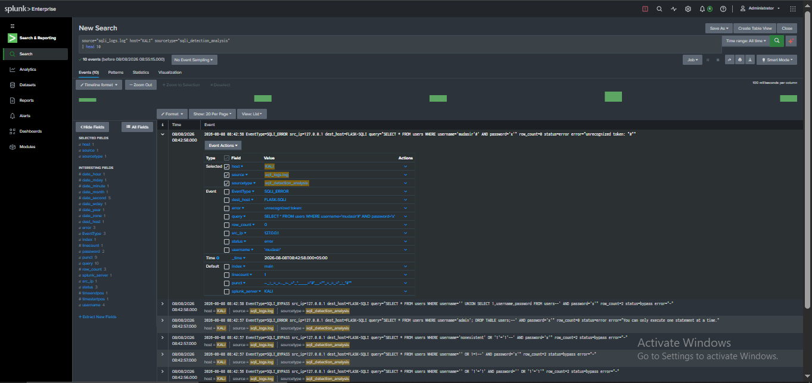

**Event type breakdown — final count:**
```spl
source="sqli_logs.log" host="KALI" sourcetype="sqli_detection_analysis"
| stats count by EventType
```
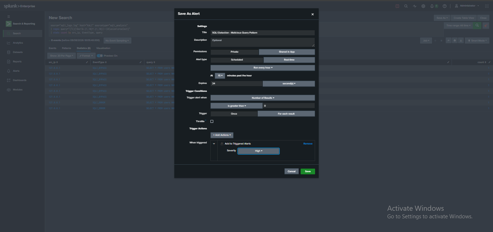
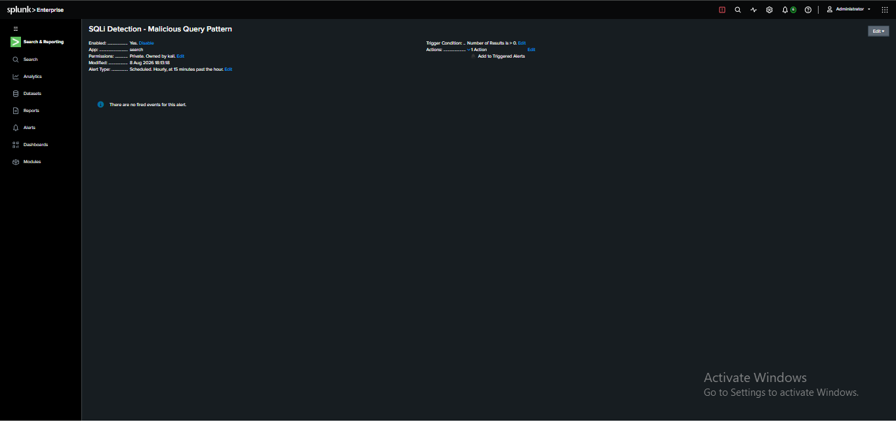

**Raw SQLI_BYPASS events — full detail:**
```spl
source="sqli_logs.log" host="KALI" sourcetype="sqli_detection_analysis" EventType=SQLI_BYPASS
```
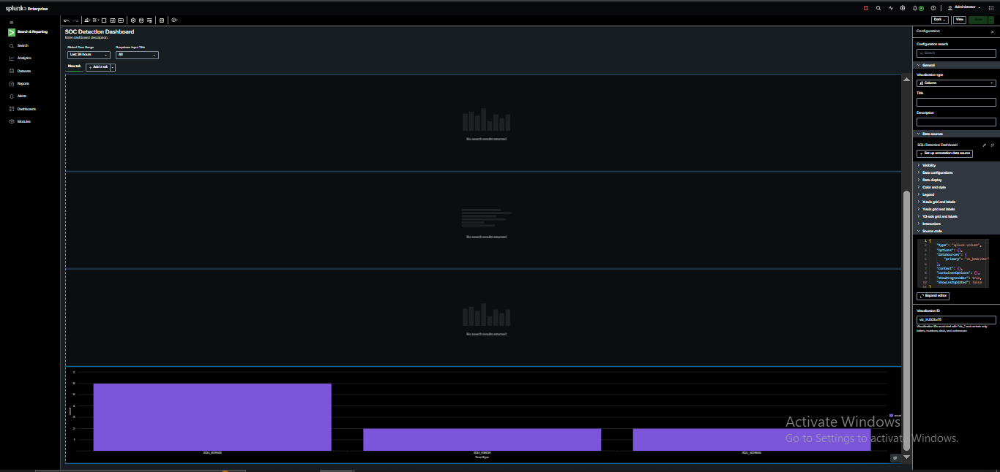

## Results
| EventType | count |
|---|---|
| SQLI_BYPASS | 6 |
| SQLI_ERROR | 2 |
| SQLI_NORMAL | 2 |

6 of 10 payloads bypassed authentication entirely without knowing a valid password. 2 caused real SQLite syntax errors (revealing injection attempts even when they don't succeed). 2 were normal legitimate-looking failed logins (baseline noise for comparison).

## Payloads That Succeeded (Auth Bypass)
```sql
SELECT * FROM users WHERE username='' OR '1'='1' AND password='' OR '1'='1'
SELECT * FROM users WHERE username='' OR 1=1--' AND password='x'
SELECT * FROM users WHERE username='' UNION SELECT 1,username,password FROM users--' AND password='x'
SELECT * FROM users WHERE username='admin' --' AND password='anything'
SELECT * FROM users WHERE username='admin'--' AND password='x'
SELECT * FROM users WHERE username='nonexistent' OR '1'='1'--' AND password='x'
```
Every one of these returned real rows from the real `users` table — genuine authentication bypass, not a simulated result.

## Findings
- The `-- ` and `#` comment injection pattern appears across most successful bypasses — attacker doesn't need to guess a password at all once the query structure is broken, the comment strips out the password check entirely.
- The UNION-based payload (`UNION SELECT 1,username,password FROM users--`) is the most dangerous single event here — it didn't just bypass login, it returned actual stored credentials (`row_count=2`) directly in the response, meaning real data exfiltration occurred, not just access.
- `SQLI_ERROR` events matter as much as `SQLI_BYPASS` — a failed injection attempt (`unrecognized token: "#"`) still proves an attacker is probing the query structure, and should trigger the same analyst attention as a successful one.
- No numeric EventCode exists in this log format (unlike Windows-style brute force logs) — detection here relies entirely on the custom `EventType` field and raw `query` string content, reinforcing that SOC analysts must adapt to whatever log schema a given application actually produces, not assume a universal format.

## Detection Opportunity
```spl
source="sqli_logs.log" host="KALI" sourcetype="sqli_detection_analysis"
| regex query="(?i)(\bor\b.{1,10}=.{1,10}|--|#|union\s+select)"
| stats count by src_ip, EventType, query
```
Rule logic: flag any query string containing classic SQLi markers — `OR`-based tautologies, inline comments (`--`, `#`), or `UNION SELECT` — regardless of whether the request ultimately succeeded, errored, or failed normally.

**MITRE ATT&CK**: T1190 — Exploit Public-Facing Application | Tactic: Initial Access
**Secondary mapping** (UNION-based data extraction): T1213 — Data from Information Repositories | Tactic: Collection

## Live Detection Alert
Converted the detection query above into a working Splunk alert.

**Alert**: SQLi Detection - Malicious Query Pattern
**Trigger condition**: Number of Results > 0
**Alert type**: Scheduled, hourly at 15 minutes past the hour
**Action**: Add to Triggered Alerts, Severity High
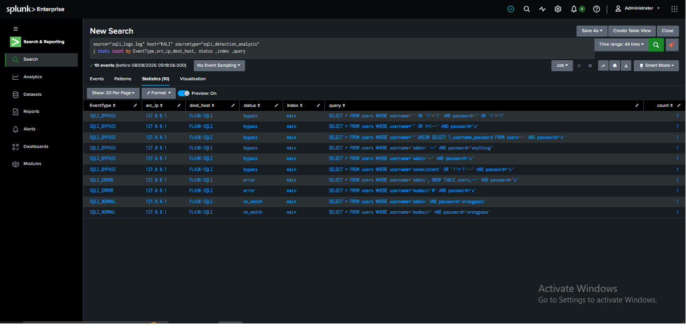
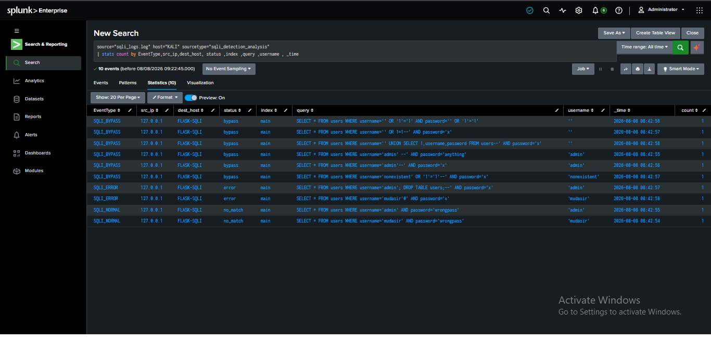

## Dashboard
Built "SOC Detection Dashboard" with panels covering event type breakdown, status distribution, and the raw bypass query volume — bar chart panel confirms SQLI_BYPASS as the dominant event type across the dataset.
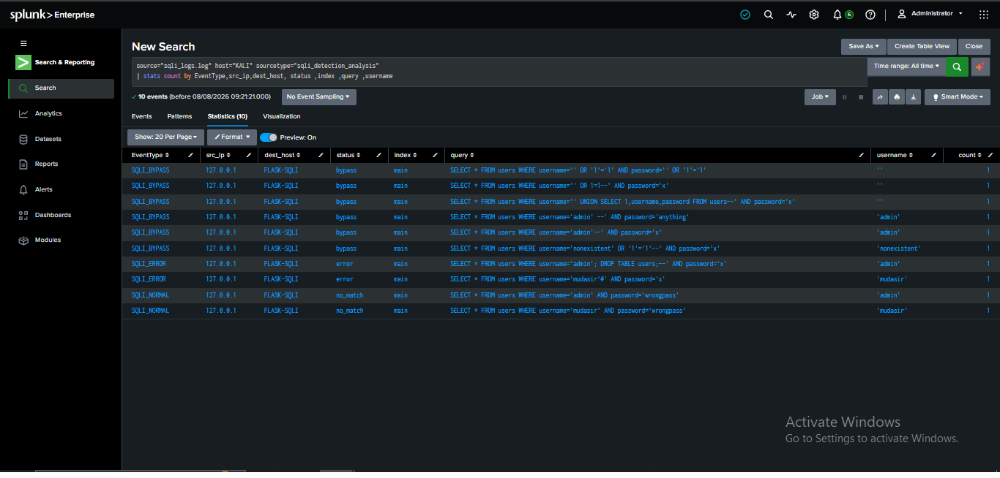

## What I Learned
- SQLi detection can't rely on a status code alone — `SQLI_BYPASS`, `SQLI_ERROR`, and even some `SQLI_NORMAL`-looking requests all need the raw query string inspected, because the attack signature lives in the query syntax itself, not just the outcome.
- A single UNION-based payload can escalate a login-bypass test into full credential theft — severity isn't uniform across "successful" SQLi events, and a SOC analyst has to read the extracted `row_count` and actual returned data, not just the pass/fail flag.
- Error-based responses are free intelligence — even a blocked/failed injection attempt confirms the endpoint is vulnerable and being actively probed, so `SQLI_ERROR` should never be dismissed as noise.
- Custom application logs (no Windows EventCode) are common in real environments — this project forced building detection logic around a bespoke `EventType` schema instead of a textbook Event ID lookup.
- Splunk Free/local scheduling doesn't support true real-time alerting the way a production SOC would need — hourly scheduled interval used as a practical substitute here.

## Next Steps
- Reduce alert interval to real-time or 1-minute for production-realistic response speed
- Add a dashboard panel showing bypass vs error vs normal ratio over time (timechart)
- Test blind/time-based SQLi payloads (`SLEEP()`-style) to see how they'd appear in this log format
- Fix the target's vulnerable query with parameterized statements and re-run the same attacker script to confirm the fix actually blocks every payload